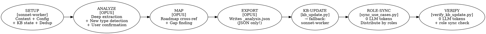
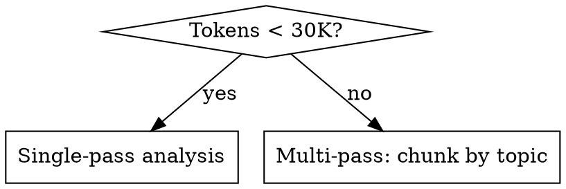

# Video Transcription Analyzer

Analyze video transcription files, extract key business/marketing insights per speaker, map them to product features, identify roadmap gaps, extract structured knowledge base items, and create structured analyses with back-references for feature development.

## Overview

7-stage pipeline: SETUP → ANALYZE → MAP → EXPORT → KB-UPDATE → ROLE-SYNC → VERIFY. Reads `.md` transcription files, creates structured analysis against project roadmap, generates back-reference IDs (e.g., `V-PA-1`) for linking from roadmap features, extracts knowledge base items in unified JSON format, organizes output into `processed/` structure, and runs automated verification to catch data integrity issues before reporting success.

Two operating modes (can work simultaneously):
- **Roadmap mode:** Map insights to product features, find gaps (requires roadmap)
- **Knowledge base mode:** Extract categorized items per EXTRACTION_CONFIG.md (requires config)

If neither roadmap nor config found, falls back to **one-off mode** (general analysis only).

## Architecture: Script-First + Sonnet Fallback

This skill uses **Opus for analysis** and **Python scripts for mechanical work**, with **sonnet-worker agent as fallback** if scripts fail.

```
┌───────────────────────────────────────────────────────────────────────────────────────────┐
│  sonnet-worker agent   OPUS (main)           Python script     Python script  Python scr. │
│  Stage 0 + SETUP   →  ANALYZE+MAP+EXPORT  →  kb_update.py   → verify.py   → sync_uc.py  │
│  [model: sonnet]       [model: opus]         [0 LLM tokens]   [0 tokens]    [0 tokens]   │
│                                               ↓ on failure                                │
│  • read configs        • read transcript     sonnet-worker     • 13 tests   • distribute │
│  • check KB state      • deep extraction     agent (fallback)  • PASS/FAIL    use-cases  │
│  • dedup check         • roadmap mapping     [model: sonnet]                  by roles   │
│  • return context_pkg  • write _analysis.json                                             │
│                        • detect new types                                                 │
│                        • ask user → update                                                │
│                          EXTRACTION_CONFIG                                                │
└───────────────────────────────────────────────────────────────────────────────────────────┘
```

**Why this split:**
- ANALYZE and MAP are intellectually demanding — require Opus-level synthesis
- SETUP uses `sonnet-worker` agent (defined in `.claude/agents/sonnet-worker.md`, runs on Sonnet 4.6) — cheap context collection
- KB-UPDATE uses `kb_update.py` Python script — zero LLM tokens, handles locking, type normalization, new category auto-creation
- If `kb_update.py` fails → Opus falls back to `sonnet-worker` agent for the same task
- `verify_kb_update.py` validates everything — zero LLM tokens

**CRITICAL: sonnet-worker agent setup.**
The project MUST have `.claude/agents/sonnet-worker.md` with `model: sonnet` in frontmatter.
This ensures SETUP and fallback KB-UPDATE run on Sonnet 4.6, not Opus.
When calling Agent tool for SETUP or KB-UPDATE fallback, use `subagent_type: "sonnet-worker"`.

**OUTPUT TOKEN OPTIMIZATION (JSON-first pipeline):**
- Opus generates ONLY `_analysis.json` — this is the canonical structured output
- `_analysis.md` is generated DETERMINISTICALLY by `kb_update.py` (no LLM needed)
- MD is a rendered view of JSON data, not independent intellectual work

**Model detection (Stage 0):**
```
Running on Opus?   → proceed with script-first architecture
Running on Sonnet? → warn user:
  "Рекомендуется запускать этот скилл на Opus 4.6 для качественного
   анализа и маппинга. Продолжить на Sonnet (всё в одном агенте)? [Y/N]"
  Y → proceed without tier split (all stages on Sonnet, no script fallback)
  N → stop, user switches to Opus
```

**Thinking mode:**
- Opus: `thinking off` by default — extraction is pattern-matching, not deductive reasoning. Enable `thinking: auto` only if roadmap has 10+ modules or you need complex gap synthesis across a batch.
- Sonnet sub-agents: always `thinking off`

## When to Use

- User has video transcription `.md` files to analyze
- User wants to map video insights to product features/roadmap
- User mentions "analyze transcription", "video analysis", "map to roadmap"
- User has YouTube/lecture transcripts and a product roadmap to cross-reference
- Processing batch of transcription files from a speaker/series
- User wants to extract knowledge base items (use-cases, prompts, quotes, tools)
- User mentions "extract from video", "knowledge base", "analyze YouTube video"

## Pipeline



---

## Stage 1: SETUP — Context Preparation `[sonnet-worker → OPUS]`

**Opus launches `sonnet-worker` agent** (via Agent tool with `subagent_type: "sonnet-worker"`) to collect all project context. This runs on Sonnet 4.6, not Opus. The agent does NOT analyze the transcription — it only reads config files and prepares a `context_package` to hand back to Opus.

**sonnet-worker agent prompt template:**
```
You are a setup agent for video transcription analysis. Do NOT read or analyze the transcription content.

Your job: collect project context and return a single JSON object.

Tasks:
1. Read CLAUDE.md (if exists) — extract project description, product modules
2. Find and read docs/roadmap.md, docs/vision.md, docs/business-model.md (if exist)
3. Glob-search for EXTRACTION_CONFIG.md (current dir, parent dirs up to 3 levels, docs/, config/, .claude/)
4. If EXTRACTION_CONFIG.md found: read it, extract categories, roles, paths
5. Verify KB state: glob "{kb_path}/*.json", read index.json if exists
6. Check processing_index.json for YouTube ID: {youtube_id} — already processed?
7. List all .md files in {source_path} that are NOT in raw/processed/

Return ONLY valid JSON, no markdown:
{
  "project_name": "...",
  "project_context": "...",
  "roadmap_modules": ["Модуль 1.1: ...", "Модуль 1.2: ..."],
  "roadmap_raw": "...",
  "extraction_config": { "categories": [...], "roles": [...], "kb_path": "...", ... } | null,
  "kb_state": { "exists": true/false, "total_items": N, "categories": [...], "format": "flat_array|legacy|unknown" },
  "already_processed": false,
  "unprocessed_files": ["path/to/file.md", ...]
}
```

After receiving `context_package`, **Opus reads the transcription file(s) itself** and proceeds with ANALYZE.

### 1a. Detect project context

```
Has CLAUDE.md?          → Read project description, product modules
Has docs/roadmap.md?    → Read phases, features, existing IDs
Has docs/vision.md?     → Read product vision, positioning
Has docs/business-model.md? → Read monetization, pricing
Nothing found?          → Standalone mode (general analysis only)
```

If project context found, confirm: "Found project: [name]. Will map insights to your [N modules across M phases]. Proceed?"

### 1a-bis. Detect EXTRACTION_CONFIG.md

```
Logic:
1. Path provided in user prompt → use it
2. Not provided → glob search for EXTRACTION_CONFIG.md:
   - Current working directory
   - Project root directory
   - Parent directories (up to 3 levels)
   - Common locations: docs/, config/, .claude/
3. Found → read it, extract: categories, roles, paths, JSON format
4. Not found → ask user:
   a) "Create knowledge base config?" → generate template EXTRACTION_CONFIG.md
   b) "One-off analysis (no knowledge base)?" → skip KB mode entirely
```

**What EXTRACTION_CONFIG.md provides:**

```markdown
# EXTRACTION_CONFIG.md (example)

## Categories
- use-cases: Real examples of AI tool usage
- opinions: Expert views on trends/tools
- trends: Industry directions
- quotes: Notable exact quotes
- statistics: Numbers, percentages, benchmarks
- tools: Tools/services mentioned with context
- pain-points: Problems speakers describe
- recommendations: Actionable advice
- prompts: Specific AI prompts mentioned

## Roles
- developer
- product-manager
- designer
- founder
- data-scientist
- marketer

## Paths
knowledge_base: ./knowledge-base/
per_video_output: ./knowledge-base/sources/
index_file: ./knowledge-base/index.json

## Output Format
json_items: true
markdown_summary: true
```

**If config found, the skill works in TWO modes simultaneously:**
- **Roadmap mode:** roadmap mapping (if project has roadmap) — Stages 2-3 unchanged
- **Knowledge base mode:** extract items by categories from config, output unified JSON, update svodные files — Stages 4-5

### 1a-ter. Verify Knowledge Base state (CRITICAL — do this BEFORE any writes)

After finding EXTRACTION_CONFIG.md, IMMEDIATELY verify the existing knowledge base:

```
1. Resolve ALL relative paths from EXTRACTION_CONFIG relative to its own location.
   Example: config at "AI stuff/EXTRACTION_CONFIG.md", path "knowledge-base/"
   → resolved absolute: "AI stuff/knowledge-base/"

2. Check if KB directory exists:
   - Glob for "{resolved_kb_path}/*.json"
   - Or: ls "{resolved_kb_path}/"

3. If directory EXISTS and has files:
   a) READ index.json — note existing sources, item counts, format
   b) READ at least ONE category file — detect format:
      - Flat array [...] → canonical format
      - Wrapped {"type": "...", "items": [...]} → legacy format (see Format Compat below)
   c) Note: DO NOT try to Write files without Reading them first!
      (Claude Code Write tool requires a prior Read on existing files)
   d) You are in APPEND mode — add new items to existing files

4. If directory DOES NOT exist:
   - mkdir -p "{resolved_kb_path}"
   - You are in CREATE mode — will create all files from scratch

5. Report to user:
   "Knowledge base found at {path}: {N} sources, {M} total items across {K} categories."
   OR: "Knowledge base not found. Will create from scratch."
```

**COMMON MISTAKE:** Assuming KB doesn't exist without checking. ALWAYS glob/ls first.

### 1b. Deduplication by YouTube ID

Before processing any file, check if it was already analyzed:

```
1. Extract YouTube ID from filename
   Expected formats:
   - "Speaker - Title [dQw4w9WgXcQ].md"
   - "dQw4w9WgXcQ.md"
   - User provides ID manually
   Regex: /\[([a-zA-Z0-9_-]{11})\]/

2. Check index.json (knowledge-base/index.json or processing_index.json):
   → Already processed?
     YES: "This video was already processed on YYYY-MM-DD.
           Existing analysis: [path]
           Options: (1) Skip  (2) Reprocess (overwrites)"
     NO: continue

3. Also check by video title (fuzzy match) in case ID format differs
```

### 1c. Select transcriptions

Scan provided path or ask for it. Show file list:

```
Found N transcription files:
1. Speaker - Title (XX KB, ~YK tokens) [YouTube ID: abc123]
2. ...
Already processed (in processed/ or index.json): [list if any]
Process all unprocessed / select specific / reprocess?
```

### 1d. ID System

Assign back-reference IDs per speaker series:

| Pattern | Example | Usage |
|---------|---------|-------|
| `V-{AUTHOR}-{N}` | `V-PA-1` | Павел Антонов, video 1 |
| `V-{AUTHOR}-{N}` | `V-RK-1` | Рома Кумар, video 1 |

Auto-detect author from filename. Ask user for author code if new speaker.

**CRITICAL: Parallel-safe ID assignment.** Multiple agents may run simultaneously. To avoid collisions:

1. **Read `processing_index.json` WITH file lock** before assigning any ID
2. **Immediately write your assigned ID** to the index (status: "in_progress") while still holding the lock
3. Only then release the lock and proceed with analysis

```python
import fcntl, json, os, time

def claim_next_id(index_path, author_code, video_title, source_file):
    """Atomically claim the next available V-XX-N ID."""
    lock_path = index_path + '.lock'
    for attempt in range(30):
        try:
            lock_fd = open(lock_path, 'w')
            fcntl.flock(lock_fd, fcntl.LOCK_EX | fcntl.LOCK_NB)
            break
        except (IOError, OSError):
            lock_fd.close()
            time.sleep(0.5 + attempt * 0.5)
    else:
        raise TimeoutError("Could not acquire lock on processing_index.json")

    try:
        with open(index_path) as f:
            index = json.load(f)

        # Find max N for this author
        prefix = f"V-{author_code}-"
        existing_ns = [int(k.split('-')[-1]) for k in index['videos'] if k.startswith(prefix)]
        next_n = max(existing_ns, default=0) + 1
        new_id = f"V-{author_code}-{next_n}"

        # Claim it immediately
        index['videos'][new_id] = {
            "title": video_title,
            "speaker": "",
            "source_file": source_file,
            "analysis_file": "",
            "status": "in_progress",
            "processing_date": ""
        }

        with open(index_path, 'w') as f:
            json.dump(index, f, ensure_ascii=False, indent=2)

        return new_id
    finally:
        fcntl.flock(lock_fd, fcntl.LOCK_UN)
        lock_fd.close()
        try:
            os.remove(lock_path)
        except OSError:
            pass
```

**Same locking for roadmap.md updates** — never write roadmap without acquiring `roadmap.md.lock` first. Pattern identical to above.

**If you cannot use Python locking** (e.g., direct Claude Code session): read `processing_index.json`, find the max ID, assign max+1, and write IMMEDIATELY before doing any analysis. Do NOT analyze first and write ID later.

### 1e. Processing strategy

For each transcription, estimate tokens. Decision:



For long transcriptions (>30K tokens): split by logical topic breaks (look for speaker transitions, "Дальше", "Теперь", "Следующий блок"), analyze each chunk, then synthesize.

**Reading long transcripts:** Transcripts can be VERY long (4+ hours). Read in chunks:
```
Read file_path offset=1 limit=300
Read file_path offset=301 limit=300
...
```
Continue until the entire file is read. Do NOT stop early.

---

## Stage 2: ANALYZE `[OPUS]`

**Opus reads the transcription file(s) itself** using the context_package received from Sonnet. Opus does NOT delegate analysis to sub-agents — this is the core intellectual work.

### Per-Speaker Extraction

For each speaker identified in the transcript, extract:

```
Speaker Profile:
- name: Full name
- role: Job title / position (if mentioned)
- company: Company / organization (if mentioned)
- background: Brief context (experience, expertise area)

Per-Speaker Data:
- use_cases: Concrete tasks they solve, tools they use, results they get
- prompts: Exact prompts if mentioned (preserve original wording)
- quotes: Notable exact quotes (original_quote field)
- tools: Tools/services they mention with usage context
- insights: Key ideas, mental models, paradigm shifts
- visual_demos: What they showed on screen (for Gemini research)
- pain_points: Problems they describe
- recommendations: Actionable advice they give
```

Group ALL insights by speaker. This is critical for multi-speaker videos (conferences, panels).

### Analysis prompt template

```
You are a product strategist analyzing a video transcription.

[PROJECT_CONTEXT — from CLAUDE.md, vision.md, roadmap.md]
[PRODUCT_MODULES — list of modules with descriptions from roadmap]
[EXTRACTION_CONFIG — categories and roles from EXTRACTION_CONFIG.md, if present]

VIDEO: [filename]
SPEAKER(S): [names]
ASSIGNED ID: [V-XX-N]

Analyze this transcription and produce a structured analysis:

## 1. Metadata
- Source, speaker(s), topic, target audience
- One-line thesis of the video

## 2. Per-Speaker Breakdown

For EACH speaker:

### [Speaker Name] — [Role, Company]
**Background:** [context if available]

#### Use Cases:
- Task → Tool → Result (with specifics)

#### Key Insights:
- [insight with context]

#### Prompts/Commands (if any):
```
[exact prompt, verbatim]
```

#### Notable Quotes:
- "[exact quote]" — context

#### Visual Demos (for Gemini):
- [what was shown on screen, timestamps if available]

## 3. Key Concepts (3-7 blocks)
For each major concept/framework from the video:
### Concept Name
- **Core idea:** 2-3 sentences
- **Evidence/examples:** Specific cases, numbers, brands mentioned
- **Framework/formula:** If speaker provides a model (e.g., "Traffic + Funnel + LTV = Revenue")
- **Speaker:** Who presented this concept

## 4. Roadmap Cross-Reference: What We ALREADY Have
(Only if roadmap available)
For each concept that maps to an existing feature in our roadmap:
- **Concept** → **Our Module X.Y / Phase N** — brief explanation of alignment
- Use exact module IDs from roadmap (e.g., "Модуль 1.1", "Фаза 2.3")

## 5. Gaps: What's MISSING in Our Backlog
(Only if roadmap available)
For each insight that reveals a gap in our product:
### Gap N: [Name]
- **From video:** What the speaker says/shows
- **In our product:** What we have (or don't have)
- **Backlog idea:** `[Module] Feature name — description`
  - Concrete, actionable feature idea
  - References the video ID: [V-XX-N]

## 6. Knowledge Base Items
(Only if EXTRACTION_CONFIG.md present)
Extract items per category from config. Each item must include:
- Category (use-case, quote, prompt, tool, trend, etc.)
- Speaker attribution
- Exact quote where applicable
- Tags and role relevance

## 7. Back-Reference Tags
List of tags for roadmap integration:
- `[V-XX-N]` — one-line summary for the roadmap reference index

QUALITY RULES:
- Concepts MUST include specific examples, numbers, brand names from the video
- Gaps MUST be actionable product features, not vague observations
- Cross-references MUST use exact module/phase IDs from roadmap
- Back-reference summary MUST be under 100 chars
- DO NOT copy-paste transcription text — synthesize and analyze
- MINIMUM 3 gaps identified (if project context available)
- Each gap idea MUST specify which module it belongs to
- Quotes MUST be exact (original_quote), not paraphrased
- Prompts MUST be verbatim as spoken/shown
- Speaker attribution on EVERY item
```

### New Category Detection (CRITICAL — Opus does this during ANALYZE)

After extracting all items, Opus checks each item's `type` against the categories from EXTRACTION_CONFIG.md (provided in context_package).

```
For each unique item type in extraction results:
  1. Is it in EXTRACTION_CONFIG.md categories? → OK, continue
  2. Is it a known variation? (e.g. "use-case" vs "use-cases") → normalize, continue
  3. Truly new type? → ASK USER:

     "Обнаружен новый тип: '{new_type}'. Его нет в EXTRACTION_CONFIG.md.
      Добавить как новую категорию?
      1. Да, добавить '{new_type}' (укажите display name)
      2. Нет, переназначить в существующую категорию: [list]
      3. Пропустить эти айтемы"

  If user says YES:
    a) Opus adds new row to EXTRACTION_CONFIG.md categories table using Edit tool
    b) The new type is included in _analysis.json as-is
    c) kb_update.py will auto-create {new_type}.json and {new_type}.md in KB

  If user says REASSIGN:
    a) Opus changes item types to the selected existing category
    b) No EXTRACTION_CONFIG update needed

  If user says SKIP:
    a) Items with this type are removed from _analysis.json
```

**EXTRACTION_CONFIG.md update format** (Opus adds a new row to the table):
```markdown
| new-type-id | Display Name | Description provided by user | new-type-id |
```

This keeps EXTRACTION_CONFIG.md synchronized with the actual KB state.

### Calibration (first file)

After analyzing the first transcription, show results to user:

```
Analysis for "Speaker - Title" [V-PA-1]:

Speakers identified: 3
  1. Name (Role, Company) — 5 use cases, 2 prompts
  2. Name (Role, Company) — 3 use cases, 0 prompts
  3. Name (Role, Company) — 1 use case, 1 prompt

Key concepts: 5 extracted
  1. Growth Hacking Formula (Traffic + Funnel + LTV)
  2. Market Pyramid (3% / 17% / 20% / 60%)
  ...

Roadmap matches: 4 found
  - Audience research → Module 2.3
  - Ad bundles → Module 3.1
  ...

New gaps identified: 6
  1. [Funnel] Advertorial generator
  2. [Analytics] Unit economics calculator
  ...

Knowledge base items: 15 extracted
  - use-cases: 8
  - prompts: 3
  - quotes: 2
  - tools: 2

Quality OK?
1. Yes, continue with remaining files
2. Need more detail
3. Need less detail
4. Adjust gap identification criteria
5. Adjust knowledge base categories
```

---

## Stage 3: MAP `[OPUS]`

### Roadmap integration

**Skip this stage if no roadmap is available.** Proceed directly to EXPORT.

For each analyzed video, prepare roadmap additions:

**1. Add to Research Index table in roadmap:**

```markdown
### Video Analysis (Growth Hacking / Marketing Strategy)

| ID | Файл | Тема |
|---|---|---|
| V-PA-1 | [Система Регулярных Продаж](../path/to/processed/analysis/file.md) | Growth Hacking: Traffic+Funnel+LTV, 97% рынка, advertorials, подписка |
| V-PA-2 | [Next Video Title](../path/to/analysis.md) | Topic summary |
```

**2. Add key metrics to "Ключевые цифры" table:**

```markdown
| Метрика | Значение | Источник |
|---|---|---|
| Конверсия интернет-магазинов (средн.) | 2.86% (Shopify data) | V-PA-1 |
| Готовы покупать сразу | 3% рынка | V-PA-1 |
```

**3. Add back-references to specific features:**

Where a gap creates a new feature, add `[V-PA-1]` reference inline:

```markdown
| Компонент | Описание | Приоритет |
|---|---|---|
| AI Growth Calculator | Симулятор юнит-экономики (CAC vs CVR vs LTV) [V-PA-1] | P2 |
```

Where existing features are validated by video, add reference:

```markdown
> **Из видео-анализов:** Таргетолог бессилен без работающей воронки — подтверждает необходимость end-to-end системы [V-PA-1]. Welcome Kit стратегия увеличивает LTV подписки [V-PA-1].
```

### Cross-referencing rules

- New features from gaps → add to appropriate phase/module with `[V-XX-N]`
- Existing features validated → append `[V-XX-N]` to existing description
- New metrics/benchmarks → add to "Ключевые цифры" table
- NEVER remove existing references, only append
- Ask user before modifying roadmap: "Ready to add N items to roadmap?"

---

## Stage 4: EXPORT `[OPUS → SONNET]`

**JSON-first pipeline: Opus writes ONLY `_analysis.json`.** The `_analysis.md` is generated deterministically from JSON by the Sonnet sub-agent — no duplicate LLM output. This saves ~50% output tokens on the EXPORT stage.

### File organization

**Naming convention:** Analysis file = original filename + `_analysis.md` suffix. Always `_analysis`, nothing else. JSON export = original filename + `_analysis.json`.

**MOVE raw to raw/processed/:** After processing, the original transcription is MOVED from the source (raw) folder to `raw/processed/` subfolder inside it. No duplicates — the raw folder should only contain unprocessed files.

**Analysis output goes to a SEPARATE processed folder** (per EXTRACTION_CONFIG `youtube_processed` path or parallel to source). Two different `processed/` folders:
- `raw/processed/` — archived raw transcriptions (done analyzing)
- `youtube/processed/` (or EXTRACTION_CONFIG path) — structured analysis output

```
youtube/raw/                              # Only UNPROCESSED transcriptions
  Speaker - Title 2.md                    # Not yet processed
  Speaker - Title 3.md                    # Not yet processed
  processed/                              # Archived raw transcriptions
    Speaker - Title 1.md                  # MOVED here after processing

youtube/processed/                        # Analysis output (per EXTRACTION_CONFIG)
  Speaker - Title 1_analysis.md           # Analysis (suffix: _analysis)
  Speaker - Title 1_analysis.json         # Unified JSON items (if KB mode)
  processing_index.json                   # Central tracker
```

```python
import shutil, os

# Move raw transcription to raw/processed/
raw_dir = os.path.dirname(source_file)
raw_processed = os.path.join(raw_dir, 'processed')
os.makedirs(raw_processed, exist_ok=True)

filename = os.path.basename(source_file)
dest = os.path.join(raw_processed, filename)
shutil.move(source_file, dest)
print(f"Moved raw transcript: {filename} → raw/processed/")
```

### Analysis MD Generation (from JSON — NO LLM output needed)

**The `_analysis.md` is generated by the Sonnet sub-agent deterministically from `_analysis.json`.** Opus does NOT write the MD file. This saves ~50% of output tokens in the EXPORT stage.

The Sonnet sub-agent (or a script) renders the MD using this template, populated from the JSON items:

```python
def generate_analysis_md(items, video_meta):
    """Generate _analysis.md from _analysis.json items.

    video_meta: dict with keys: title, filename, date, youtube_id, speakers (list of dicts with name/role/company)
    items: list of extracted KB items from _analysis.json
    """
    from collections import defaultdict
    from datetime import datetime

    lines = []
    lines.append(f"# Анализ: {video_meta['title']}")
    lines.append("")
    lines.append(f"**Источник:** Транскрипция видео `{video_meta['filename']}`")
    speakers_str = ", ".join(f"{s['name']} ({s.get('role', '')}, {s.get('company', '')})" for s in video_meta['speakers'])
    lines.append(f"**Спикер(ы):** {speakers_str}")
    lines.append(f"**Дата анализа:** {datetime.now().strftime('%Y-%m-%d')}")
    lines.append(f"**YouTube ID:** {video_meta.get('youtube_id', 'N/A')}")
    lines.append("")
    lines.append("---")
    lines.append("")

    # Group items by speaker
    by_speaker = defaultdict(lambda: defaultdict(list))
    for item in items:
        speaker_name = item.get("source", {}).get("speaker", {}).get("name", "Unknown")
        item_type = item.get("type", "other")
        by_speaker[speaker_name][item_type].append(item)

    # Category display names
    cat_names = {
        "use-cases": "Юзкейсы", "opinions": "Мнения", "trends": "Тренды",
        "quotes": "Цитаты", "statistics": "Статистика/Метрики", "tools": "Инструменты",
        "pain-points": "Боли/Проблемы", "recommendations": "Рекомендации", "prompts": "Промпты"
    }

    lines.append("## Спикеры")
    lines.append("")

    for speaker_name, types_dict in by_speaker.items():
        # Find speaker info from first item
        first_item = next(iter(next(iter(types_dict.values()))))
        sp = first_item.get("source", {}).get("speaker", {})
        role = sp.get("role", "")
        company = sp.get("company", "")
        lines.append(f"### {speaker_name} — {role}, {company}")
        lines.append("")

        for cat_id in ["use-cases", "recommendations", "opinions", "trends", "statistics",
                        "tools", "pain-points", "quotes", "prompts"]:
            cat_items = types_dict.get(cat_id, [])
            if not cat_items:
                continue
            lines.append(f"#### {cat_names.get(cat_id, cat_id)} ({len(cat_items)})")
            lines.append("")
            for item in cat_items:
                content = item.get("content", {})
                summary = content.get("summary", "")
                details = content.get("details", "")
                quote = content.get("original_quote")
                lines.append(f"- **{summary}**")
                if details:
                    lines.append(f"  {details}")
                if quote:
                    lines.append(f'  > "{quote}"')
                lines.append("")

        lines.append("---")
        lines.append("")

    # Statistics table
    stats_items = [i for i in items if i.get("type") == "statistics"]
    if stats_items:
        lines.append("## Ключевые метрики")
        lines.append("")
        lines.append("| Метрика | Значение/Контекст | Спикер |")
        lines.append("|---|---|---|")
        for item in stats_items:
            c = item.get("content", {})
            sp = item.get("source", {}).get("speaker", {}).get("name", "")
            lines.append(f"| {c.get('summary', '')} | {c.get('details', '')} | {sp} |")
        lines.append("")
        lines.append("---")
        lines.append("")

    # Summary
    type_counts = defaultdict(int)
    for item in items:
        type_counts[item.get("type", "other")] += 1

    lines.append("## Сводка")
    lines.append("")
    lines.append(f"Всего извлечено айтемов: {len(items)}")
    lines.append("")
    for cat_id, count in sorted(type_counts.items(), key=lambda x: -x[1]):
        lines.append(f"- {cat_names.get(cat_id, cat_id)}: {count}")
    lines.append("")

    return "\n".join(lines)
```

**The video_meta is extracted from the JSON items themselves** (all items share the same source fields), so no additional LLM input is needed.

### Unified JSON Format Output (Knowledge Base mode)

**This is the ONLY file Opus generates in the EXPORT stage.** The `_analysis.json` is an array of items in the unified format:

```json
[
  {
    "id": "yt-YYYY-MM-DD-slug-001",
    "type": "use-case",
    "source": {
      "platform": "youtube",
      "title": "Video title",
      "url": "https://youtube.com/watch?v=VIDEO_ID",
      "date": "YYYY-MM-DD",
      "channel": "Channel name",
      "speaker": {
        "name": "Speaker name",
        "role": "Role if known",
        "company": "Company if known"
      }
    },
    "content": {
      "summary": "1-2 sentences describing the item",
      "details": "Detailed description with context",
      "original_quote": "Exact quote if available, null otherwise"
    },
    "tags": ["tag1", "tag2"],
    "roles": ["developer", "product-manager"],
    "sentiment": "positive",
    "extracted_at": "YYYY-MM-DD"
  },
  {
    "id": "yt-YYYY-MM-DD-slug-002",
    "type": "prompt",
    "source": {
      "platform": "youtube",
      "title": "Video title",
      "url": "https://youtube.com/watch?v=VIDEO_ID",
      "date": "YYYY-MM-DD",
      "channel": "Channel name",
      "speaker": {
        "name": "Speaker name",
        "role": "CTO",
        "company": "Acme Corp"
      }
    },
    "content": {
      "summary": "Prompt for code review automation",
      "details": "Speaker demonstrated using this prompt to review PRs with Claude",
      "original_quote": "Review this PR focusing on security vulnerabilities and performance bottlenecks..."
    },
    "tags": ["code-review", "automation", "claude"],
    "roles": ["developer"],
    "sentiment": "positive",
    "extracted_at": "YYYY-MM-DD"
  }
]
```

**ID generation rules:**
- Format: `yt-YYYY-MM-DD-slug-NNN`
- `YYYY-MM-DD`: video date (from metadata or filename)
- `slug`: short kebab-case from video title (max 30 chars)
- `NNN`: sequential number within this video (001, 002, ...)

**Valid `type` values (MUST match EXTRACTION_CONFIG.md category IDs exactly):**
`use-cases` | `opinions` | `trends` | `quotes` | `statistics` | `tools` | `pain-points` | `recommendations` | `prompts`

Note: `use-cases` (plural with hyphen), NOT `use-case`. Match the exact category ID from EXTRACTION_CONFIG.

(Or custom types from EXTRACTION_CONFIG.md categories)

**Valid `sentiment` values:**
`positive` | `negative` | `neutral` | `mixed`

### One-off Mode

When no EXTRACTION_CONFIG.md found and user chooses "one-off":

- Create per-source `_analysis.md` only (standard markdown analysis)
- Do NOT create `_analysis.json`
- Do NOT update any knowledge-base/ files
- Do NOT update index.json
- Still do roadmap mapping if roadmap is available
- Still move files to processed/

### processing_index.json

```json
{
  "settings": {
    "source_path": "...",
    "output_path": "...",
    "project_context": "ai-marketing-platform"
  },
  "author_codes": {
    "Павел Антонов": "PA",
    "Рома Кумар": "RK"
  },
  "videos": {
    "V-PA-1": {
      "title": "Система Регулярных Продаж и Роста Выручки в 2026",
      "speaker": "Павел Антонов",
      "youtube_id": "dQw4w9WgXcQ",
      "source_file": "...",
      "analysis_file": "...",
      "analysis_json": "...",
      "status": "completed",
      "gaps_found": 6,
      "kb_items_extracted": 15,
      "roadmap_refs_added": 4,
      "processing_date": "2026-03-01"
    }
  }
}
```

### Handoff: Script-First + Sonnet Fallback (end of Stage 4)

After Opus finishes writing `_analysis.json` (the ONLY file Opus writes), it runs the **kb_update.py script** via Bash:

```bash
cd "{project_ai_stuff_dir}" && python3 "{skill_dir}/references/kb_update.py" \
    --analysis-json "{output_path}/{filename}_analysis.json" \
    --kb-path "{kb_path}" \
    --source-key "{source_key}" \
    --youtube-id "{youtube_id}" \
    --video-title "{title}" \
    --video-date "{date}" \
    --channel-name "{channel}" \
    --speaker-name "{speaker_name}" \
    --extraction-config "{extraction_config_path}" \
    --speaker-role "{role}" \
    --speaker-company "{company}" \
    --raw-original "{raw_transcript_path}" \
    --raw-archived "{raw_processed_path}" \
    --processing-index "{processing_index_path}" \
    --author-code "{author_code}" \
    --video-id "{V-XX-N}"
```

**The script handles everything:**
- Generates `_analysis.md` from JSON (deterministic, 0 LLM tokens)
- Normalizes types (use-case → use-cases, etc.)
- Creates new category files if Opus discovered new types
- Updates all KB category JSON + MD files with file locking
- Updates index.json with correct totals
- Updates processing_index.json
- Archives raw transcript

**Decision tree after script runs:**

```
Exit code 0 (SUCCESS)?
  → Proceed to Stage 6: VERIFY

Exit code 1 (FAILURE)?
  → Read script error output
  → Launch sonnet-worker agent as FALLBACK:

    Agent tool with subagent_type: "sonnet-worker"
    Prompt: "The kb_update.py script failed with errors: {error_output}.
    Please complete the KB-UPDATE manually. [full task description with all paths and params]"

  → After sonnet-worker completes → proceed to Stage 6: VERIFY
```

**IMPORTANT:** The script reads categories dynamically from:
1. EXTRACTION_CONFIG.md (if `--extraction-config` provided)
2. Existing KB JSON files (auto-discovers)
3. New types from the analysis JSON itself (auto-creates)

---

## Stage 5: KB-UPDATE `[kb_update.py script → sonnet-worker fallback]`

**Skip this stage if no EXTRACTION_CONFIG.md is present or if in one-off mode.**

This stage is handled by the `kb_update.py` Python script (primary) or `sonnet-worker` agent (fallback). Zero LLM tokens in the primary path.

The script does all the mechanical work: update category files, regenerate MDs, update indexes, archive raw transcript.

### 5a. Update per-category JSON files

For each category defined in EXTRACTION_CONFIG.md:

```
knowledge-base/
  use-cases.json        ← All use-case items from all videos
  use-cases.md          ← Markdown summary of use-cases
  prompts.json          ← All prompts
  prompts.md
  quotes.json
  quotes.md
  tools.json
  tools.md
  trends.json
  trends.md
  statistics.json
  statistics.md
  pain-points.json
  pain-points.md
  recommendations.json
  recommendations.md
  opinions.json
  opinions.md
  sources/              ← Per-video analysis files
    yt-2026-03-01-video-title/
      analysis.md
      analysis.json
  index.json            ← Master index of all processed videos
```

**CANONICAL JSON FORMAT: FLAT ARRAY**

Category files (`{category}.json`) use flat arrays — NOT wrapped objects:

```json
[
  {"id": "yt-...", "type": "use-cases", "source": {...}, "content": {...}, ...},
  {"id": "tg-...", "type": "use-cases", "source": {...}, "content": {...}, ...}
]
```

**Format Compatibility (CRITICAL — legacy files may use wrapped format):**

Some files may exist in legacy format `{"type": "...", "items": [...]}` (from telegram-channel-processor). When reading, ALWAYS handle both:

```python
data = json.load(f)
if isinstance(data, list):
    items = data                    # canonical flat array
elif isinstance(data, dict) and 'items' in data:
    items = data['items']           # legacy wrapped format
else:
    items = []                      # unknown/empty — start fresh
```

When WRITING, ALWAYS write **flat array** format. This automatically migrates legacy files on first update.

**PARALLEL SAFETY: ALL knowledge-base/ files are SHARED resources.**

Multiple agents (YouTube analyzer, Telegram processor, manual scripts) may write to the same KB files simultaneously. EVERY read-modify-write on ANY file in `knowledge-base/` MUST use file locking.

**Use `locked_read_modify_write` for ALL KB file operations:**

```python
import fcntl, time, os, json

def locked_read_modify_write(filepath, modify_fn, mode='json'):
    """Safely read-modify-write a shared file with exclusive lock.
    Use this for ALL knowledge-base/ file operations.
    """
    lock_path = filepath + '.lock'
    max_retries = 30

    for attempt in range(max_retries):
        try:
            lock_fd = open(lock_path, 'w')
            fcntl.flock(lock_fd, fcntl.LOCK_EX | fcntl.LOCK_NB)
            break
        except (IOError, OSError):
            lock_fd.close()
            wait = 0.5 + (attempt * 0.5)
            print(f"File locked by another agent, waiting {wait:.1f}s: {os.path.basename(filepath)}")
            time.sleep(wait)
    else:
        raise TimeoutError(f"Could not acquire lock after {max_retries} retries: {filepath}")

    try:
        if mode == 'json':
            if os.path.exists(filepath):
                with open(filepath) as f:
                    data = json.load(f)
            else:
                data = []
            new_data = modify_fn(data)
            with open(filepath, 'w') as f:
                json.dump(new_data, f, ensure_ascii=False, indent=2)
        elif mode == 'write_md':
            md_content = modify_fn(None)
            with open(filepath, 'w') as f:
                f.write(md_content)
    finally:
        fcntl.flock(lock_fd, fcntl.LOCK_UN)
        lock_fd.close()
        try:
            os.remove(lock_path)
        except OSError:
            pass
```

**Files that MUST be locked:**
- `knowledge-base/index.json` — master index, written by both skills
- `knowledge-base/{category}.json` — category items, written by both skills
- `knowledge-base/{category}.md` — regenerated from JSON, lock during write
- `youtube/processing_index.json` — YouTube video tracker

**If you cannot use Python** (e.g., direct Claude Code session without Bash): use the Read→Edit→Write tool sequence, but be aware of race conditions. Minimize time between Read and Write.

**Update procedure for each category file:**

```
1. LOCK {category}.json
2. READ existing content (handle both flat array and wrapped format)
   - If file doesn't exist: start with empty array []
3. Filter items from current video's _analysis.json by type == category
4. Check for duplicates:
   - Same source.url + similar content.summary → skip (already exists)
   - Same original_quote from same speaker → skip
5. Append new items
6. Sort all items by source.date (newest first)
7. Write back as FLAT ARRAY to {category}.json
8. UNLOCK {category}.json
9. LOCK {category}.md
10. Regenerate {category}.md entirely from the updated JSON
11. UNLOCK {category}.md
```

**Example using locked_read_modify_write:**

```python
for cat_id in categories_to_update:
    cat_json = os.path.join(kb_path, f'{cat_id}.json')
    cat_md = os.path.join(kb_path, f'{cat_id}.md')

    def update_category(existing):
        # Format compat
        if isinstance(existing, list):
            items = existing
        elif isinstance(existing, dict) and 'items' in existing:
            items = existing['items']
        else:
            items = []
        # Dedup + append
        existing_ids = {i['id'] for i in items}
        new = [i for i in video_items if i['type'] == cat_id and i['id'] not in existing_ids]
        items.extend(new)
        items.sort(key=lambda i: i.get('source', {}).get('date', ''), reverse=True)
        return items  # flat array

    locked_read_modify_write(cat_json, update_category, mode='json')

    # Regenerate MD under lock
    def regen_md(_):
        with open(cat_json) as f:
            all_items = json.load(f)
        return generate_category_md(cat_id, all_items)

    locked_read_modify_write(cat_md, regen_md, mode='write_md')

# Update index.json under lock too
def update_index(existing):
    # ... update sources, categories, last_updated ...
    return existing

locked_read_modify_write(os.path.join(kb_path, 'index.json'), update_index, mode='json')
```

### 5b. Update per-category Markdown files (MUST DO — not optional!)

For each `{category}.md`, regenerate **entirely** from the corresponding JSON. MD is always regenerated from scratch, NOT appended.

**Use the EXTRACTION_CONFIG.md format:**

```markdown
# {Название категории}

Последнее обновление: YYYY-MM-DD
Всего айтемов: N

---

## YYYY-MM-DD | {Source Title} | {Platform}

### [{summary}]
- **Спикер:** {name}, {role}
- **Sentiment:** {sentiment}
- **Роли:** {roles}
- **Цитата:** "{original_quote}"
- **Детали:** {details}
- **Теги:** {tags}
- **Источник:** [{url}]({url})

---
```

**Python helper for MD generation:**

```python
def generate_category_md(cat_id, items, cat_names=None):
    """Generate markdown from flat array of items.
    cat_names: dict mapping cat_id to display name, e.g. {"use-cases": "Use Cases"}
    """
    from datetime import datetime
    display_name = (cat_names or {}).get(cat_id, cat_id)
    today = datetime.now().strftime("%Y-%m-%d")
    lines = [f"# {display_name}", "", f"Последнее обновление: {today}",
             f"Всего айтемов: {len(items)}", "", "---", ""]
    for item in items:
        src = item.get("source", {})
        content = item.get("content", {})
        speaker = src.get("speaker", {})
        lines.append(f"## {src.get('date', 'unknown')} | {src.get('title', 'unknown')} | {src.get('platform', 'unknown')}")
        lines.append("")
        lines.append(f"### {content.get('summary', 'No summary')}")
        sp_name = speaker.get("name", "unknown")
        sp_role = speaker.get("role", "")
        lines.append(f"- **Спикер:** {sp_name}{', ' + sp_role if sp_role else ''}")
        lines.append(f"- **Sentiment:** {item.get('sentiment', 'neutral')}")
        roles = item.get("roles", [])
        if roles: lines.append(f"- **Роли:** {', '.join(roles)}")
        quote = content.get("original_quote")
        if quote: lines.append(f'- **Цитата:** "{quote}"')
        details = content.get("details", "")
        if details: lines.append(f"- **Детали:** {details}")
        tags = item.get("tags", [])
        if tags: lines.append(f"- **Теги:** {', '.join(tags)}")
        url = src.get("url", "")
        if url: lines.append(f"- **Источник:** [{url}]({url})")
        lines.extend(["", "---", ""])
    return "\n".join(lines)
```

**CRITICAL:** If you update any `{category}.json`, you MUST also regenerate the corresponding `{category}.md`. Sonnet and other models tend to skip this step — do NOT skip it.

### 5c. Update index.json

The master index tracks all processed videos:

```json
{
  "last_updated": "YYYY-MM-DD",
  "total_videos": 5,
  "total_items": 87,
  "videos": [
    {
      "youtube_id": "dQw4w9WgXcQ",
      "title": "Video Title",
      "url": "https://youtube.com/watch?v=dQw4w9WgXcQ",
      "channel": "Channel Name",
      "date": "YYYY-MM-DD",
      "speakers": ["Speaker 1", "Speaker 2"],
      "items_extracted": 15,
      "categories": {
        "use-cases": 8,
        "prompts": 3,
        "quotes": 2,
        "tools": 2
      },
      "analysis_path": "sources/yt-2026-03-01-video-title/analysis.md",
      "analysis_json_path": "sources/yt-2026-03-01-video-title/analysis.json",
      "processed_at": "YYYY-MM-DD"
    }
  ]
}
```

### 5d. Deduplication during KB update

When adding items to svodные files:

1. **Exact match:** Same `id` field → skip entirely
2. **Source match:** Same `source.url` + same `type` + same `speaker.name` + similar `content.summary` (>80% overlap) → skip
3. **Quote match:** Same `content.original_quote` from same speaker → skip
4. **Reprocessing:** If video is being reprocessed, REMOVE all old items with matching `source.url` first, then add fresh items

---

## Gemini Visual Research (Optional)

When speakers show visual demos and user wants visual analysis, create Gemini research folders:

```
{transcript_folder}/
├── analysis.md
├── analysis.json
└── Gemini_Research/
    ├── 01_Speaker_Name/
    │   ├── README.md       ← Brief: name, company, what to look for
    │   ├── prompt.md       ← Detailed Gemini prompt
    │   └── results/        ← Empty folder for user to fill
    │       └── .gitkeep
    ├── 02_Speaker_Name/
    │   ├── README.md
    │   ├── prompt.md
    │   └── results/
    │       └── .gitkeep
    └── ...
```

**README.md per speaker:**
```markdown
# [Speaker Name] — Gemini Visual Research

**Company:** [company]
**Topic:** [what they presented]

## What to Look For
- [Specific UI elements shown]
- [Prompts visible on screen]
- [Configuration panels]
- [Results/outputs displayed]

## Timestamps (approximate)
- [XX:XX] — [description of what's shown]
```

**prompt.md per speaker:**
```markdown
# Gemini Prompt: [Speaker Name]

Watch the video from [start] to [end] and extract:

1. All text visible on screen (prompts, code, configurations)
2. UI elements and tool interfaces shown
3. Any results/outputs displayed
4. Step-by-step workflow as demonstrated visually

Context from transcript:
[Relevant transcript excerpt providing context for what to look for]

Output format:
- Screenshots description with timestamps
- Extracted text (verbatim)
- Tool identification (name, version if visible)
```

**Create Gemini folders only when:**
- User explicitly requests visual analysis
- Speaker clearly demonstrated something visual (code, UI, prompts on screen)
- Transcript mentions "let me show you", "as you can see on screen", etc.

---

## Batch Processing

When multiple files from same speaker:

1. Process files in logical order (series first, then standalone)
2. Track cumulative gaps — deduplicate across videos
3. After all videos processed, show summary:

```
Batch complete: 10 videos analyzed

Speaker: Павел Антонов (V-PA-1 through V-PA-10)
Total gaps found: 23 (15 unique after dedup)
Roadmap additions ready: 15 new features, 8 metric updates

Knowledge base items extracted: 87
  - use-cases: 34
  - prompts: 12
  - quotes: 15
  - tools: 11
  - statistics: 8
  - pain-points: 7

Proceed with roadmap update? (Y/N)
Proceed with knowledge base update? (Y/N)
```

4. For parallel processing of independent videos, use sub-agents:
   - Each sub-agent runs the full two-tier pipeline for one transcription
   - Main Opus agent: orchestrates, deduplicates gaps across videos, updates roadmap
   - Sub-agents for individual videos: each sub-agent is Sonnet (SETUP prep) → internal Opus call (ANALYZE+MAP) → Sonnet (KB-UPDATE)
   - If running on Sonnet without tier split: each parallel sub-agent is also Sonnet doing everything

---

## Content Ideas (Post-Analysis)

After analysis, suggest potential content ideas:

- Ideas for posts → `content/ideas/inbox/` (if in ProdFeatAI Brand context)
- Topics for videos
- Prompts worth preserving
- Tools worth reviewing

This is advisory only — do not create content files automatically.

---

## Extraction Quality Checklist (for ensuring thorough extraction)

After completing initial extraction, do a SECOND PASS through the transcript looking specifically for these commonly-missed item types:

### Commonly Under-Extracted Categories

**Recommendations** — speakers often give actionable advice as asides, not in dedicated "recommendation" sections:
- Management practices ("focus on 2-3 people first", "no urgent releases during training")
- Anti-patterns ("don't do X because Y")
- Self-learning tips ("backtrack conversations", "use technique Z")
- Hiring practices ("ask about tools used last month")
- Process improvements ("transparency creates accountability")

**Pain-points** — look beyond explicit complaints:
- Role transitions ("sync-to-async is the hardest shift")
- Organizational friction ("junior devs have no clear role now")
- Bottleneck descriptions ("human review slows everything down")

**Opinions** — controversial or nuanced positions:
- Counter-intuitive stances ("conservatives are needed for balance")
- Qualified views ("AI doesn't make you dumber per se, depends on usage")
- Market predictions ("test assignments will become OK again")

**Quotes** — colorful/memorable phrasing, metaphors:
- Look for metaphors, analogies, humor
- Unusual framing of common ideas

### Minimum Item Counts per Category

For a 1-hour video with a single knowledgeable speaker, expect MINIMUM:
- use-cases: 3-5
- recommendations: 7-12
- opinions: 4-6
- pain-points: 3-5
- tools: 2-4
- trends: 3-5
- quotes: 3-5
- prompts: depends on topic (0 is OK if no prompts mentioned)
- statistics: depends on topic

If your extraction falls significantly below these minimums, re-read the transcript looking specifically for missed items.

### Second-Pass Extraction Prompt

After the first pass, scan the transcript again asking:
1. "What actionable advice did the speaker give that I haven't extracted as a recommendation?"
2. "What problems/frustrations were described that I haven't captured as pain-points?"
3. "What specific tools/services were mentioned that I haven't listed?"
4. "Were there colorful quotes or strong opinions I missed?"
5. "What controversial or counter-intuitive positions did the speaker take?"

---

## Stage 6: ROLE-SYNC `[sync_use_cases.py — 0 LLM tokens]`

**This stage runs AFTER KB-UPDATE completes, BEFORE VERIFY.** It distributes use-cases from the main `use-cases.json` into per-role files in `knowledge-base/use-cases/`.

### How to run

To show delta (new items from this session), extract use-case IDs from `_analysis.json` and pass them via `--new-ids`:

```bash
# Extract use-case IDs from analysis JSON
NEW_UC_IDS=$(python3 -c "import json; items=json.load(open('{analysis_json_path}')); print(','.join(i['id'] for i in items if i['type']=='use-cases'))")

# Run sync with new IDs for delta reporting
cd "{project_ai_stuff_dir}" && python3 knowledge-base/sync_use_cases.py --base-dir knowledge-base/ --new-ids "$NEW_UC_IDS"
```

If `--new-ids` is not provided, the script still works but only shows totals (no delta).

**The script:**
- Reads `use-cases.json` (master file)
- Uses `use-cases/_role-mapping.json` for role normalization
- Distributes items into `use-cases/use-cases-{role}.json` + `.md` files
- Items with multiple roles appear in multiple role files
- Unmapped roles go to `use-cases-general.json` with a WARNING
- Reports: delta per role (if `--new-ids` provided) + total per role

### When to skip

- If no use-cases were extracted (0 items of type `use-cases` in `_analysis.json`)
- If `knowledge-base/sync_use_cases.py` does not exist

### On failure

If the script fails or is missing, warn the user but proceed to VERIFY:
```
WARNING: sync_use_cases.py не найден или завершился с ошибкой.
Use-cases добавлены в основной use-cases.json, но НЕ раскиданы по ролям.
Запустите вручную: python3 knowledge-base/sync_use_cases.py --base-dir knowledge-base/
```

---

## Stage 7: VERIFY `[Python script — NO LLM tokens]`

**This stage runs AFTER ROLE-SYNC completes, BEFORE reporting success to the user.** It uses a Python script (`references/verify_kb_update.py`) that costs zero LLM tokens — pure data validation.

**Why this matters:**
- Sub-agents (especially Sonnet) can silently fail: write partial files, skip categories, overwrite existing data
- Parallel agents can race-condition on shared KB files
- Without verification, you report "success" based on the sub-agent's self-report, not actual file state
- Python test runs in <1 second, catches issues that would cost hours to debug later

### How to run

After the KB-UPDATE sub-agent reports completion, run via Bash:

```bash
cd "{project_ai_stuff_dir}" && python3 "{skill_dir}/references/verify_kb_update.py" \
    "{analysis_json_path}" \
    "{kb_path}" \
    "{youtube_id}" \
    "{source_key}" \
    --raw-original "{raw_original_path}" \
    --raw-archived "{raw_archived_path}"
```

**Example:**
```bash
cd "/Users/user/project/AI stuff" && python3 ~/.claude/skills/video-transcription-analyzer/references/verify_kb_update.py \
    "youtube/processed/2026-02-27_..._analysis.json" \
    "knowledge-base/" \
    "7XL8pqiDAxY" \
    "youtube_7XL8pqiDAxY_ai-talent-hub" \
    --raw-original "youtube/raw/2026-02-27_....md" \
    --raw-archived "youtube/raw/processed/2026-02-27_....md"
```

### What it checks (13 tests)

| Test | What it verifies |
|------|-----------------|
| T1 | `_analysis.json` exists, valid JSON, flat array, non-empty |
| T2 | `_analysis.md` exists, has content |
| T3 | Every item from JSON has its summary present in MD (JSON↔MD consistency) |
| T4 | All items have required fields (id, type, source, content, tags, roles, sentiment, extracted_at + nested) |
| T5 | No duplicate IDs in analysis |
| T7 | Each category JSON in KB contains this video's items, correct count, no duplicate IDs |
| T8 | Each category MD exists and is non-empty |
| T9 | `index.json` has source entry with correct items_count and items_by_type |
| T10 | `index.json` category totals match actual file item counts |
| T11 | New source key present in all relevant category sources lists |
| T12 | Raw transcript archived (moved from raw/ to raw/processed/) |
| T13 | No overwrites — other sources' item counts unchanged (parallel safety) |
| T14 | Role sync: if use-cases were extracted, per-role files in `use-cases/` contain this video's items. Check at least 2 role files match expected counts |

### Interpreting results

```
RESULT: ALL PASSED (13 tests)    → Report success to user
RESULT: FAILED (N errors, ...)   → DO NOT report success. Analyze failures:
```

**On FAIL — decision tree:**

```
Error in T1-T5 (analysis files)?
  → Problem in EXPORT stage (Opus). Re-examine _analysis.json.

Error in T7-T8 (category files)?
  → Problem in KB-UPDATE sub-agent. Common causes:
    - Sonnet skipped a category
    - Sonnet didn't regenerate MD from JSON
    - Format mismatch (wrapped vs flat array)
  → Fix: Re-run KB-UPDATE sub-agent for the failed categories only.

Error in T9-T11 (index.json)?
  → Sub-agent didn't update index properly.
  → Fix: Manually edit index.json to add missing source/categories.

Error in T12 (archiving)?
  → Raw file not moved. Run: mv raw/file.md raw/processed/file.md

Error in T13 (overwrites)?
  → CRITICAL: Another source's data was lost!
  → Investigate: was a parallel agent running? Did Sonnet Write instead of Edit?
  → Recovery: git checkout the overwritten KB files from last commit.
```

### Pre-snapshot for stronger overwrite detection

For even stronger overwrite protection, save a snapshot of source item counts BEFORE running the pipeline (during SETUP stage):

```python
# In SETUP sub-agent, after reading index.json:
import json
pre_snapshot = {k: v.get('items_count', 0) for k, v in index['sources'].items()}
with open('/tmp/kb_pre_snapshot.json', 'w') as f:
    json.dump(pre_snapshot, f)
```

Then pass to verify:
```bash
python3 verify_kb_update.py ... --pre-snapshot /tmp/kb_pre_snapshot.json
```

This compares exact item counts before vs after, catching even subtle overwrites.

---

## Final Report Template (MANDATORY)

**After ALL stages complete (including ROLE-SYNC), show the user a structured report with TWO sections:**

```
## Результат анализа: {Speaker} — "{Title}"

**Video ID:** `{youtube_id}` | **Дата:** {date} | **Канал:** {channel}

### Knowledge Base — добавлено {N} новых айтемов (из этого видео):

| Категория | + Новых | Всего в KB |
|-----------|---------|------------|
| recommendations | +X | Y |
| opinions | +X | Y |
| use-cases | +X | Y |
| ... | ... | ... |

**Итого в KB после обновления:** {TOTAL} айтемов

### Use-Cases по ролям — добавлено {M} новых записей (из этого видео):

| Роль | + Новых | Всего в роли |
|------|---------|--------------|
| Предприниматели | +X | Y |
| Продакт-менеджеры | +X | Y |
| Разработчики | +X | Y |
| ... | ... | ... |

**Итого use-cases после обновления:** {TOTAL_UC} айтемов, {TOTAL_ROLE_ENTRIES} записей по ролям

### Ключевые темы:
- {topic 1}
- {topic 2}
- ...

### Verification: {ALL N TESTS PASSED / FAILED}
### Role Sync: {OK / WARNING}
```

**HOW TO GET THESE NUMBERS:**
- **+ Новых per category:** count items in `_analysis.json` grouped by `type` — these are the new items from this session
- **Всего в KB per category:** after KB-UPDATE, read each `{category}.json` and count total items (`len(items)`)
- **Итого в KB:** sum of all category totals from `index.json` → `total_items` (or sum category file lengths)
- **+ Новых per role:** for each role file in `use-cases/`, count how many items have IDs matching this video's `_analysis.json` use-case IDs
- **Всего в роли:** total items in each `use-cases-{role}.json`
- **Итого use-cases:** total items in `use-cases.json`; total role entries = sum of all role file sizes

**CRITICAL:** The report MUST show DELTA (new items from this session) as the primary number, with totals as context. Never show only totals — the user needs to see what THIS run added. The report MUST have BOTH sections — KB update results AND role distribution results. This confirms to the user that the full pipeline (including sync) completed successfully. If role sync was skipped (no use-cases or script missing), note it explicitly in the report.

---

## Common Mistakes

| Mistake | Fix |
|---------|-----|
| Copy-pasting transcription as "analysis" | Synthesize: describe WHAT is useful, not repeat verbatim |
| Generic gaps ("improve marketing module") | Specific: "[Модуль Воронки] AI-генератор advertorial-страниц" |
| Missing module IDs in cross-references | ALWAYS use exact IDs: "Модуль 1.1", "Фаза 2.3" |
| Duplicate gaps across videos of same speaker | Deduplicate in batch mode, merge similar ideas |
| Adding to roadmap without asking | ALWAYS confirm before modifying roadmap |
| Not creating processing_index.json | Track state for incremental processing |
| Analyzing without reading roadmap first | MUST read roadmap, vision, business-model before analysis |
| Running full pipeline on Sonnet without warning | Warn user and offer choice: Sonnet (all-in-one) or switch to Opus (two-tier) |
| Opus doing KB-UPDATE file operations | Run kb_update.py script first (0 tokens). Fall back to sonnet-worker agent only if script fails |
| Using subagent_type "general-purpose" for SETUP/KB-UPDATE | Use subagent_type "sonnet-worker" — runs on Sonnet 4.6, not Opus. Saves ~126K Opus tokens per video |
| Skipping context_package handoff | Opus MUST receive sonnet-worker's context_package before reading transcript |
| Opus delegating ANALYZE to sonnet-worker | ANALYZE and MAP are Opus-only — never delegate the intellectual core |
| Not detecting new types during ANALYZE | Opus MUST check item types against EXTRACTION_CONFIG categories. Ask user about new types BEFORE writing _analysis.json |
| Skipping EXTRACTION_CONFIG update for new types | When user confirms a new category, Opus MUST add it to EXTRACTION_CONFIG.md table before proceeding |
| Forgetting to move original transcription | MOVE raw transcript to `raw/processed/` as the FINAL step. `raw/` should only contain unprocessed files |
| IDs colliding with existing | Scan roadmap for existing V-XX-N before assigning |
| Paraphrasing quotes instead of exact text | ALWAYS use original_quote with exact wording |
| Missing speaker attribution on items | EVERY knowledge base item MUST have speaker name, role, company |
| Not checking index.json for duplicates | ALWAYS check YouTube ID / title before processing |
| Updating KB without EXTRACTION_CONFIG.md | Only update svodные files when config is present |
| Creating analysis.json in one-off mode | One-off = markdown only, no JSON, no KB updates |
| Not sorting KB files by date | Svodные files MUST be sorted by source.date (newest first) |
| Overwriting KB items on reprocess | REMOVE old items for that video first, THEN add fresh |
| Skipping Gemini folders for visual demos | Ask user if they want visual research when demos are detected |
| Not reading entire long transcript | Read ALL chunks to the end, never stop early |
| Assuming KB doesn't exist without checking | ALWAYS glob/ls for knowledge-base/ BEFORE trying to create files |
| Writing to existing file without Reading first | Claude Code Write tool REQUIRES a prior Read on existing files |
| Mixing JSON formats (flat array vs wrapped) | ALWAYS read with format detection, ALWAYS write flat array `[...]` |
| Using `use-case` instead of `use-cases` | Type values MUST match EXTRACTION_CONFIG category IDs exactly |
| Stopping at first-pass extraction | Do a SECOND PASS looking for missed recommendations, opinions, pain-points |
| Extracting too few items for a long video | 1-hour video should yield 30-50+ items minimum across all categories |
| Opus generating both _analysis.md AND _analysis.json | Opus writes ONLY _analysis.json. The MD is generated by kb_update.py script (0 LLM tokens) |
| LLM generating _analysis.md independently | _analysis.md is a DETERMINISTIC render of _analysis.json — kb_update.py handles this, no LLM needed |
| Reporting success without running VERIFY | ALWAYS run `verify_kb_update.py` after KB-UPDATE. Never trust script or agent self-reports — verify actual file state |
| Skipping VERIFY stage to save time | VERIFY costs 0 LLM tokens and <1 second. It catches overwrites, missing files, and data corruption that would cost hours to debug |
| Not saving pre-snapshot for overwrite detection | Save source item counts BEFORE pipeline runs (in SETUP) for strongest parallel-safety guarantee |
| Running kb_update.py without --extraction-config | ALWAYS pass --extraction-config if config path is known. Script reads categories dynamically from it + KB files |
| Not falling back to sonnet-worker when script fails | If kb_update.py exits with code 1, MUST launch sonnet-worker agent to complete KB-UPDATE manually |
| Not running sync_use_cases.py after KB-UPDATE | ALWAYS run `sync_use_cases.py` after KB-UPDATE if use-cases were extracted. Without it, new use-cases exist in master file but NOT in per-role files (`use-cases/use-cases-{role}.json`) |
| Not including role sync results in final report | Final report MUST have TWO sections: KB update results AND role distribution results. User needs to see both to confirm full pipeline success |